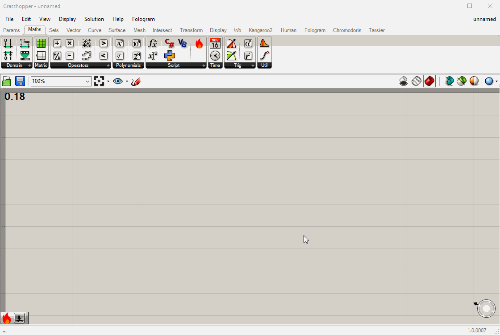
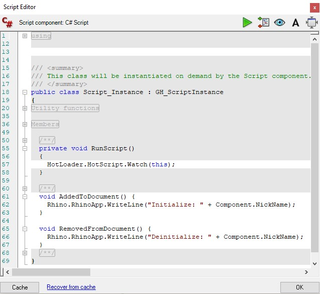

# HotLoader

Hotloader extends Grasshopper's scripting tools by enhancing the capabilities of the Script Editor and allowing ad-hoc creation of components.

## HotComponent

HotComponent is a plugin that enables writing and distributing C# plugins on the fly using native code editors.

### Why

1. The native Grasshopper script editor is inconvenient to use for tasks with any complexity. The new editor in Rhino 8 is a marked improvement, but still has some of the following limitations.
2. Distributing scripts that use external references requires users to also have the same references, and locate them. This also includes NuGet packages.
3. Lifecycle methods are limited (see HotScript) in script components.
4. Precompiled C# plugins can run faster than script components (as you can use the true parameter types without casting)
5. Customization if script components is limited (icons, custom drawing, right click menus, etc.).
6. Writing Grasshopper plugins has some overhead in setting up the project and distributing the plugin.

Some of these challenges are assisted in isolation by tools such as [Script Parasite](https://github.com/arendvw/ScriptParasite) or the [new script editor in Rhino 8](https://discourse.mcneel.com/t/rhino-8-feature-scripteditor-cpython-csharp/128353), or even just the [project templates](https://marketplace.visualstudio.com/items?itemName=McNeel.Rhino7Templates2022).

`HotComponent` became feasible with the introduction of [Yak](https://developer.rhino3d.com/guides/yak/what-is-yak/) - as until now it would have been inconvient to share HotComponents because the user would have to pre-install a plugin to load them. Now, the user simply needs to accept the prompt to install `HotLoader` and the definition will open as normal.

### Who

`HotComponent` is designed for those who already have the tools installed to write Grasshopper or Rhino plugins. This usually means Visual Studio or Visual Studio for Mac.

`HotComponent` is ideal when you want to easily share something more complex that what you'd write in a script component, but not so generic that you'd write a complete plugin for it.

### How

HotComponent works by creating a C# project, similar to what you'd create if you were writing a normal component in a custom Grasshopper plugin. When you edit and compile the code, the component is hot-loaded into your Grasshopper definition just like pressing play on the C# script editor.

1. Place a `HotComponent` into a Grasshopper document.
2. The `.csproj` will open in your native editor.
3. Edit the code and rebuild the project.
4. Swap back to Grasshopper and use your new component. Customize and rebuild as required.
5. Optionally, attach your debugger to Rhino to hit breakpoints in your code.

The full source code for the component and the compiled binaries (including references) are embedded in the component, and hence saved with the Grasshopper definition.

### Example

The best example of what you'd see when editing a HotComponent is in the [Template](Template/CustomComponent.cs). However you also have access to the full suite of `GH_Component` methods such as serialization, lifecycle and appearance methods.

From the end-user's perspective (if it's not you!) a HotComponent is indistinguishable from a regular component, except that:

1. The source code is editable
2. The custom component will not appear in the menu.



`HotComponent` works on both Mac and Windows, and HotComponents are editable with any tool that can compile a `.csproj` - tested with `Visual Studio 2022` and `Visual Studio for Mac`.

## HotScript

HotScript is a C# API that adds lifecycle events to regular Grasshopper C# scripting components.

### Why

To subscribe and unsubscribe from events.

If you subscribe to an event in a script component, there are many scenarios where you will lose the chance to unsubscribe from the event. The most difficult to catch is when the source code changes, but the component still remains active, which is why `HotScript` exists. It tracks when the _script_ is added or removed to the document, rather than the script _component_.

In normal precompiled plugins, `AddedToDocument` and `RemovedFromDocument` provide an opportunity for initialization and disposal. These don't exist for scripting components, limiting their usefulness for anything event-based, for example sensor input or websockets.

### Who

`HotScript` is designed for people who need to interface ad-hoc with external tools or libaries that require persistent connections or event subscriptions.

### How

`HotScript.Watch` provides a variety of method signatures all with the same goal: allow the user to define the two missing methods, `AddedToDocument` and `RemovedFromDocument`.

1. Add a reference to `HotLoader.gha` by right clicking on your C# Script component and going to "Manage Assemblies". Ensure you change the search type to ".gha" and navigate to the install location.

2. In `RunScript`, tell `HotScript` to monitor the lifecycle of your component:

```C#
HotLoader.HotScript.Watch(this);
```

3. In `Custom Additional Code`, define your `AddedToDocument` and `RemovedFromDocument` methods.

```C#
void AddedToDocument() {
	Rhino.RhinoApp.WriteLine("Initialize: " + Component.NickName);

}

void RemovedFromDocument() {
	Rhino.RhinoApp.WriteLine("Deinitialize: " + Component.NickName);
}
```



Alternatively, the same code could be condensed using a lambda function in `RunScript`:

```C#
HotLoader.HotScript.Watch(this, () =>  {
	Rhino.RhinoApp.WriteLine("Initialize: " + Component.NickName);
	}, () => {
	Rhino.RhinoApp.WriteLine("Deinitialize: " + Component.NickName);
	});
```

### Example

This example creates an object, subscribes to an event, updates the counter, and schedules the component to update and output the new count. When the component is deleted or the document is closed, the event is unsubscribed and the object is disposed.

```C#
private void RunScript(ref object Count)
{
	HotLoader.HotScript.Watch(this);
	Count = count;
}

// <Custom additional code>
  int count = 0;
  MyExampleObject myObj;

  void AddedToDocument() {
    myObj = new MyExampleObject();
    myObj.Updated += OnMyEventUpdated;
  }

  void RemovedFromDocument() {
    myObj.Updated -= OnMyEventUpdated;
    myObj.Dispose();
  }

  void OnMyEventUpdated(object sender, EventArgs args) {
    count++;
    HotLoader.HotScript.ScheduleSolution(this);
  }
// </Custom additional code>
```

Note that `HotScript.ScheduleSolution` is a utility method; the component can be expired by any normal means.

# Contributing

Contributions and suggestions are welcome. Please use GitHub issues to communicate.
